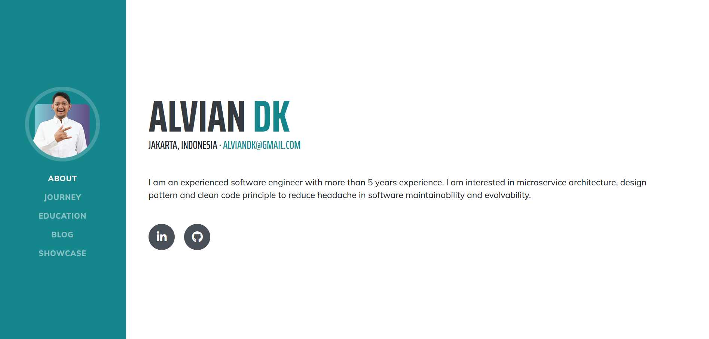

# Overview
Website Pribadi merupakan salah satu sarana bagi software developer untuk menunjukkan kemampuan serta menaikkan nilai jual. Website yang dibuat biasanya berisi deskripsi, pengalaman, skill, blog, dan lain lain. Pada umumnya website pribadi yang dibuat oleh developer bersifat statis dalam penulisan kontennya. Artinya, konten tulisan yang bisa dibaca oleh orang lain langsung ditulis pada halaman websitenya. Lawannya adalah web dengan konten yang dinamis, biasanya konten dinamis bisa diubah dengan fitur cms. Konten yang statis cenderung kurang fleksibel apabila ingin diubah apabila dibandingkan dengan konten yang bersifat dinamis. Oleh karena itu, saya ingin membuat website pribadi yang bersifat dinamis. Sehingga untuk mengubah atau menambah isi kontennya lebih mudah. Selain konten yang dinamis, website pribadi yang saya buat memiliki beberapa fitur untuk lebih menjual skill saya. 

# Functional Requirement
Fitur yang akan dibuat diantaranya About Me, Journey, Education, Blog, dan Showcase.
## About Me
Fitur About Me untuk memperkenalkan identitas pribadi saya berupa nama, title, deskripsi singkat, email, dan beberapa link social media yang berhubungan dengan skill profesional seperti linkedin dan github. Ada juga bagian interest yang berisi tentang topik dalam software development yang saya kuasai maupun ingin dipahami lebih lanjut. Pada fitur about me juga terdapat menu download resume untuk mendownload resume dalam versi pdf. Konten resume juga bersifat dinamis dan bisa diatur lewat cms untuk info apa saja yang ingin saya tampilkan.

## Journey
Fitur Journey berisi sub menu experience, tech stack dan competition. Menu experience berisi tentang pengalaman profesional saya dalam bekerja sebagai software developer. Tech stack adalah nama nama technology berupa bahasa pemrograman, framework, library, maupun tools yang saya kuasai dalam mendevelop software. Competition models berisi kompetisi apa saja  yang pernah saya ikuti maupun saya juarai.  

## Education
Fitur Education terdiri dari sub menu pendidikan yang pernah saya jalani, penulisan ilmiah yang saya tulis untuk mencapai kelulusan, serta kolaborasi saya dengan orang lain dalam membantu penulisan ilmiah mereka.

## Blog
Fitur Blog sama dengan fitur blog pada umumnya. Berisi tulisan-tulisan yang saya tulis secara pribadi yang berhubungan dengan technology. Tipe penulisan dapat dalam bentuk cerita, opini, tutorial step by step, penjelasan tentang bagaimana cara kerja teknologi, maupun review tentang teknologi yang pernah saya pakai.

## Showcase
Fitur Showcase berisi tentang project portfolio yang bersifat eksperimental maupun eksplore untuk menunjukkan kemampuan saya dalam membuat sesuatu. Project portfolio yang saya kerjakan akan bersifat variatif dan terdapat demo berupa video serta link yang dapat dikunjungi untuk melihat langsung. Terdapat juga link ke repo github apabila ingin melihat source code secara langsung.

# Technical Requirement
* Bahasa Pemrograman: Python
* Web Framework: Django
* Platform: Web Browser

# Wiki
* [PRD of the Website](https://github.com/alviandk/personal_website/wiki/PRD---Alvian's-Personal-Website)
